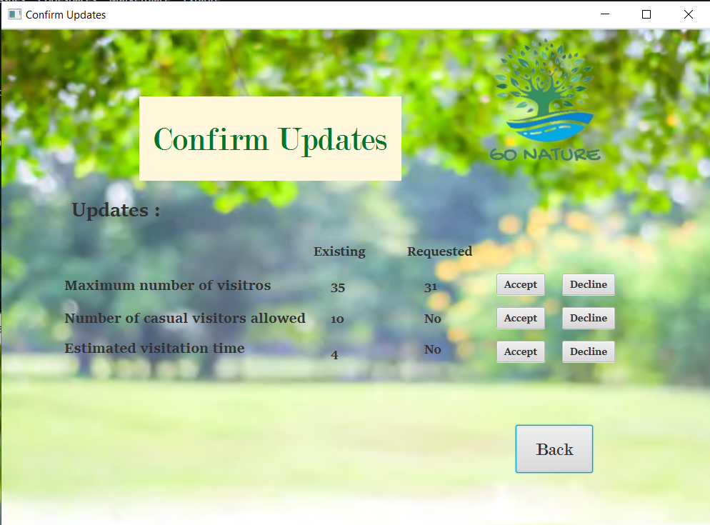

# GoNature
GoNature is a software system for managing visits to parks and nature reservesץ
The system is decentralized, and enables local entry control (for example limiting the number of visitors) at the various sites (parks), as well as central management of activity control and sales promotion.

## Sign In
The visitor can sign in with his ID number; if there is no order for him, he will be navigated to the make order page. (Note: each visitor can make one order.)

## Visitation Order
There are different types of orders:
Individual, Family, Small Group, or Organized Group
(Note: all the inputs will be checked on clicking "submit," and if there are errors, a pop-up will appear with the error details.)

* Making a successful order

* No available places:

  If there aren't enough available places at the chosen time, the visitor can select another time from the table with the available time for his order or wait in the waitlist.

After choosing to add to waitlist             |  Choose another available time for this order for the next 7 days
:--------------------------------------------:|:----------------------------------------------------------------:
  |  

#### Cancel Order
When a visitor cancels his order, a message is sent to the first order that has enough places on the waiting list at the same time. The visitor must confirm the massage within one hour; if he doesn't, the place is handed over to the next visitor.
This is the message sent to the visitor on the waitlist to confirm his order:

## Authorized users:
### * Park manager:
He can change the maximum number of visitors, casual visitors, and the estimated visitation time; any change in these needs approval from the department manager; once approved the parameters will be updated.

In addition, he can make discounts, also needs the department manager's approval. As well as preparing monthly reports to the department manager.

----
### * Department manager:
On top of the approvalation of the park managers’s requests, the department manager can view the prepared reports from the park manager.

The home page:

The generated reports from the the park manager |  The park manager's requests
:----------------------------------------------:|:-----------------------------:
  | 
#
### * Service representative:
He is responsible for making a Guid register & Family / Individual Subscription

Guide Registration |  Family / Individual Subscription 
:----------------------------------------------:|:-----------------------------:
  | 
